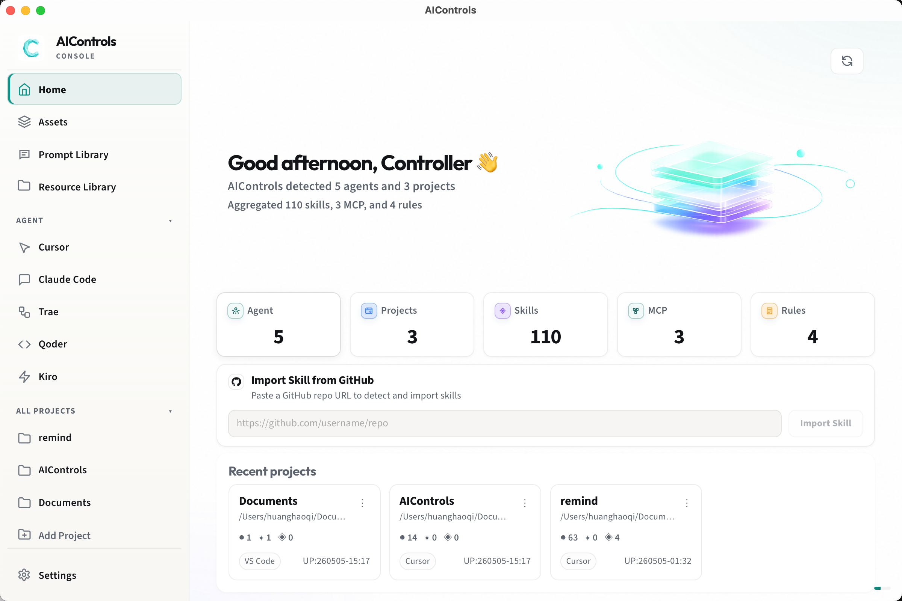
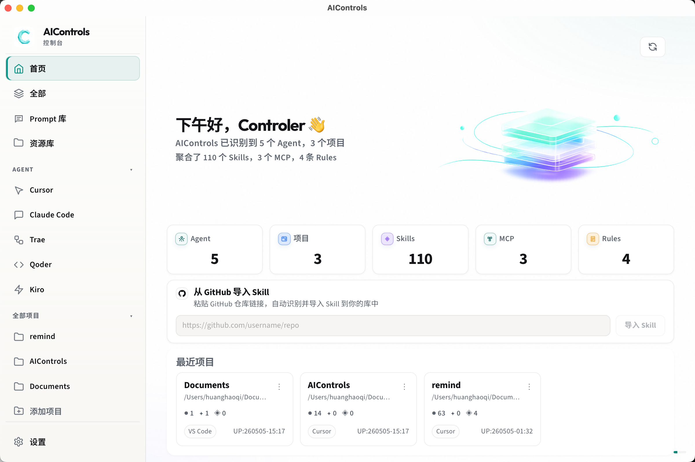

# AIControls - Vibecoding Project Hub

<p align="center">
  
</p>

<p align="center">
  <strong>MANAGE YOUR PROJECTS, AGENTS, AND AI ASSETS IN ONE LOCAL HUB.</strong>
</p>

<p align="center">
  
  
  
  
  
</p>

**AIControls** 是一个面向 **vibecoding** 环境的本地项目管理中心。它把你的项目、AI Agent、Skills、MCP、Rules、Prompt、资源链接和备份能力集中到一个桌面应用里，让“边想边写、边调边管”的 AI 开发工作流有一个清晰的控制台。

在 vibecoding 时代，一个项目不再只有代码仓库本身，还会包含提示词、上下文、Agent 规则、可复用技能、MCP 工具、素材资源、知识链接和同步配置。AIControls 的目标是成为这些内容的统一入口：看清项目状态，管理 AI 资产，沉淀工作流，并把重要配置安全地留在本地。

**AIControls** is a local-first project hub for vibecoding workflows. It helps you manage software projects together with the AI assets around them: agents, skills, MCP servers, rules, prompts, resources, classifications, and backups.

## Product Preview

<p align="center">
  
</p>

<p align="center">
  
</p>

首页会把本机项目、Agent、Skills、MCP、Rules 和常用入口汇总成一张工作台视图。左侧是 Agent 与项目导航，中间可以查看当前资产统计、从 GitHub 仓库导入 Skill，并快速进入最近项目。

The dashboard gives you a live overview of your local vibecoding workspace: detected projects, agent environments, reusable skills, MCP servers, rules, GitHub skill import, and recent project entry points.

## What It Does

AIControls 不是单一的 Agent 管理器，而是围绕 vibecoding 工作流组织项目和 AI 资产的桌面中心。

- **Project management hub**: 汇总本机项目和最近工作区，让你快速回到当前正在 vibecoding 的项目现场。
- **AI asset management**: 统一管理与项目配套的 Skills、MCP、Rules、Prompt、资源链接、说明文档和素材。
- **Agent environment inventory**: 自动发现 Cursor、Claude Code、Codex、Hermes、OpenClaw、Trae、Qoder、Kiro，并汇总全局与项目级配置。
- **Skill workflow**: 从本地或 GitHub 仓库导入 Skill，并复制到全局或项目 Agent 目录，支持冲突处理与目标检测。
- **Prompt library**: 管理图片、代码、文档、纯文本 Prompt，支持分组、搜索、示例输出和图片示例。
- **Resource library**: 保存链接、标签和笔记，粘贴一段文本也能提取首个 URL，方便沉淀项目上下文。
- **AI classification**: 使用 DeepSeek 为技能、MCP、Rules 生成场景分类和简短说明，并优先读取本地缓存。
- **Backup and restore**: 通过 Gitee 同步关键配置，支持立即备份、断开连接和从仓库恢复。
- **Local-first desktop**: 基于 Tauri 构建，密钥与数据优先保存在本机应用数据目录。

## Why AIControls

vibecoding 会让开发速度变快，但也会带来新的混乱：一个项目可能散落着多个 Agent 的规则、不同来源的 Skill、临时写下的 Prompt、上下文链接、设计素材和同步配置。AIControls 试图把这些内容变成可见、可管理、可迁移的资产。

它适合你在本地维护一个长期可用的 AI 开发工作台：每个项目都有自己的上下文，每个 Agent 都能复用能力，每个 Prompt 和资源都能被找回，每次配置变化都可以备份。

## Supported Agents

Cursor · Claude Code · Codex · Hermes · OpenClaw · Trae · Qoder · Kiro

## Tech Stack

Tauri 2 · React 19 · Vite 6 · TypeScript · Rust

## Getting Started

```bash
npm install
npm run tauri dev
```

如果只想启动前端调试：

```bash
npm run dev
```

## Build

```bash
npm run build
npm run tauri build
```

Intel（x86_64）Mac 安装包（在 Apple Silicon 上需先安装 Rust target：`rustup target add x86_64-apple-darwin`）：

```bash
npm run build
npm run tauri:build:mac-intel
```

GitHub Actions：在仓库的 Actions 里手动运行 **Tauri macOS Intel (x86_64)**，可下载构建产物。

## Scripts

```bash
npm run dev       # Vite dev server
npm run build     # Vite production build
npm run preview   # Preview built frontend
npm run test      # Vitest
npm run tauri     # Tauri CLI
npm run tauri:build:mac-intel   # Tauri 桌面包（macOS Intel / x86_64）
```

## Notes

- DeepSeek API Key 只保存在本机，用于生成 AI 资产分类与摘要缓存。
- Gitee 同步需要在设置页配置 OAuth 应用信息与目标仓库。
- 桌面能力依赖 Tauri 后端；部分扫描、复制、备份功能需要在桌面端运行。
