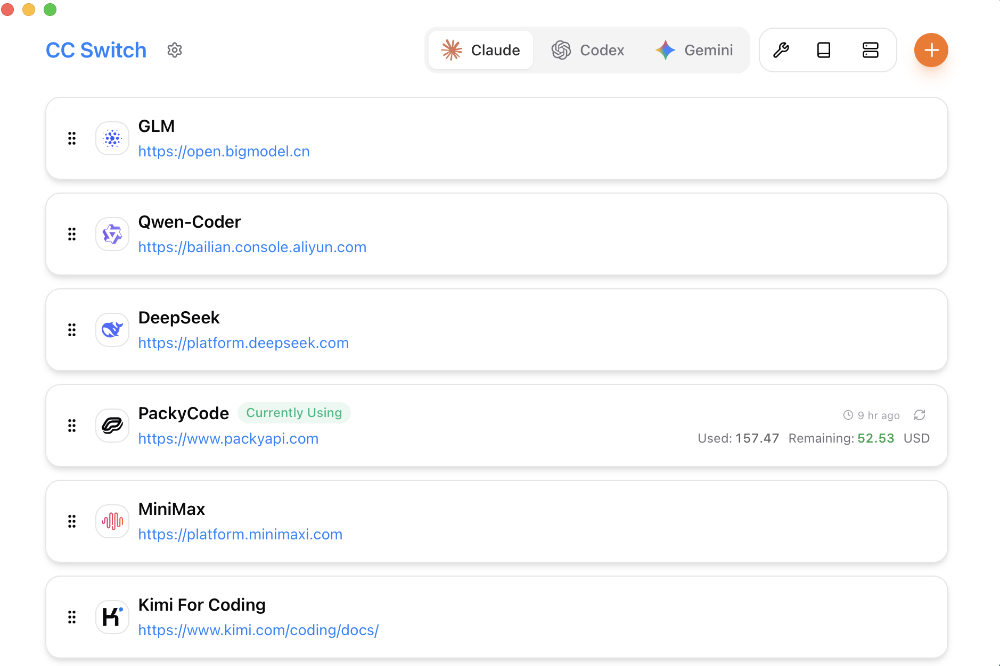

<div align="center">

# OpenSunstar

### AI コーディング CLI ツールのオールインワン・デスクトップマネージャー

[](https://github.com/alisunstar/OpenSunstar/releases)
[](LICENSE)
[](https://github.com/alisunstar/OpenSunstar/releases)
[](https://tauri.app/)

**公式サイト：** [opensunstar.github.io](https://opensunstar.github.io/) · [OpenSunstar.io](https://OpenSunstar.io)

[English](README.md) | [中文](README_ZH.md) | 日本語 | [Deutsch](README_DE.md) | [Changelog](CHANGELOG.md)

</div>

---

## 概要

AI 支援開発では **Claude Code**、**Codex**、**Gemini CLI** など複数の CLI を使い分けますが、各ツールの設定形式はバラバラです。API プロバイダーの切り替えは JSON / TOML / `.env` の手編集が必要で、MCP や Skills もアプリ間で統一管理しにくい——

**OpenSunstar** は、これらを一つのネイティブデスクトップアプリに集約します。

- **50+ プリセット** によるビジュアル切り替え
- **MCP / Skills / Prompts** 統合パネル
- **ポートフォリオ** マルチリポジトリ Git ダッシュボードと AI インサイト
- **SQLite** によるアトミック書き込み

> **v0.1.0** は初の公開リリースです。機能は成熟しており、本番利用に適した状態です。

## 主な特長

- **1 アプリ、7 CLI ツール**
- **Simple Connect** — 3 ステップで API 接続
- **トレイから即時切り替え**
- **ローカルプロキシ & フェイルオーバー**
- **ポートフォリオ洞察** — 7 日間統一コミット指標、AI 週次レポート
- **クラウド同期** — WebDAV、S3 互換ストレージ
- **クロスプラットフォーム** — Windows / macOS / Linux · Tauri 2

## スクリーンショット

| メイン画面 | プロバイダー追加 |
| :--------: | :--------------: |
|  |  |

## 機能

### 接続 & プロバイダー

- 50+ 組み込みプリセット
- Claude Code / Codex / Gemini CLI 共通プロバイダー
- インポート/エクスポート、共有設定スニペット
- Deep Link（`OpenSunstar://`）

### Agent 設定

- 統合 **MCP** パネルとディスカバリレジストリ
- **Skills** — GitHub / ZIP / skills.sh / ClawHub / ModelScope
- **Prompts**、コマンド、Hooks、無視ルール、権限、Subagent
- セッションマネージャー、OpenClaw ワークスペースエディタ

### プロキシ & 信頼性

- ローカルルーティングプロキシ
- 自動フェイルオーバー & サーキットブレーカー
- アプリ単位のプロキシテイクオーバー

### ポートフォリオ & 使用量

- **ポートフォリオダッシュボード** — 7 日間統一メトリクス
- AI サマリー、ヘルススコア、週次レポート
- 使用量ダッシュボード、予算アラート

### プラットフォーム

- ダーク / ライト / システムテーマ
- 多言語：简体中文 · 繁體中文 · English · 日本語
- 自動バックアップ、自動アップデート

[v0.1.0 リリースノート](docs/release-notes/v0.1.0-ja.md) · [ユーザーマニュアル](docs/user-manual/ja/README.md)

## 対応ツール

| Claude Code | Claude Desktop | Codex | Gemini CLI | OpenCode | OpenClaw | Hermes |
| :---------: | :------------: | :---: | :--------: | :------: | :------: | :----: |

## クイックスタート

1. 最新版を [Releases](https://github.com/alisunstar/OpenSunstar/releases/latest) からダウンロード
2. **Simple Connect** → プロバイダー選択 → API キー保存 → CLI に適用
3. メイン UI または **システムトレイ** から切り替え
4. ほとんどの CLI は **ターミナル再起動** が必要（Claude Code はホットスイッチ対応）

## ダウンロード

| プラットフォーム | パッケージ |
| ---------------- | ---------- |
| **Windows** | `.msi` または Portable `.zip` |
| **macOS** | `.dmg` · `brew install --cask OpenSunstar` |
| **Linux** | `.deb` · `.rpm` · `.AppImage` · AUR |

**要件：** Windows 10+ · macOS 12+ · Ubuntu 22.04+

## FAQ

<details>
<summary><strong>どのツールに対応していますか？</strong></summary>

7 ツール：Claude Code、Claude Desktop、Codex、Gemini CLI、OpenCode、OpenClaw、Hermes。
</details>

<details>
<summary><strong>切り替え後にターミナルの再起動は必要ですか？</strong></summary>

通常は必要です。Claude Code のみホットスイッチに対応しています。
</details>

<details>
<summary><strong>データはどこに保存されますか？</strong></summary>

- データベース：`~/.OpenSunstar/OpenSunstar.db`
- 設定：`~/.OpenSunstar/settings.json`
- バックアップ：`~/.OpenSunstar/backups/`
</details>

## ドキュメント

**[ユーザーマニュアル](docs/user-manual/ja/README.md)** · **[ポートフォリオ](docs/kanban.md)** · **[v0.1.0 リリースノート](docs/release-notes/v0.1.0-ja.md)**

## 開発

```bash
pnpm install
pnpm tauri dev
pnpm typecheck
pnpm test:unit
pnpm tauri build
```

## コントリビューション

```bash
pnpm typecheck && pnpm format:check && pnpm test:unit
```

[CONTRIBUTING.md](CONTRIBUTING.md) を参照。

## スポンサー

**[SUPPORT.md](SUPPORT.md)**

## ライセンス

[MIT](LICENSE) © Jason Young
