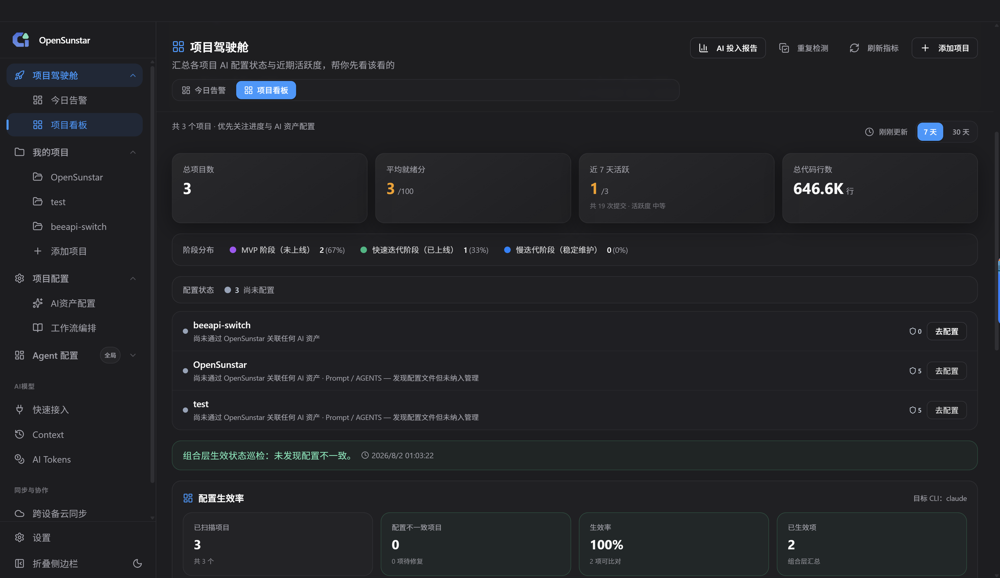
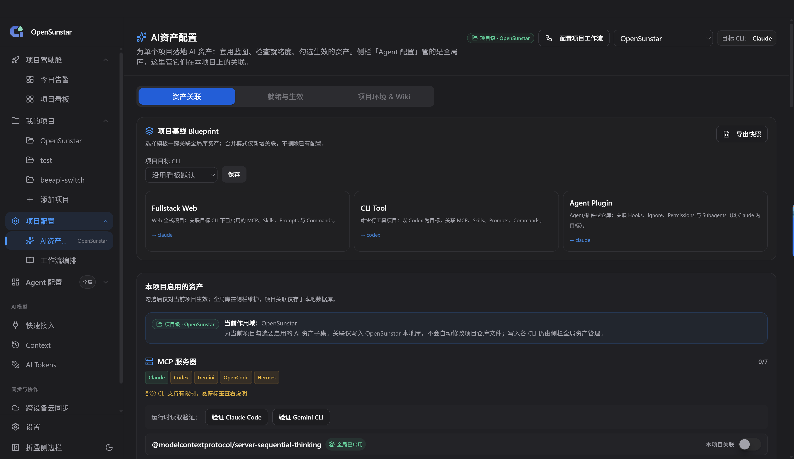

<div align="center">

# OpenSunstar

### ローカルファーストの AI コーディングワークフロー工程化プラットフォーム

[](https://github.com/alisunstar/OpenSunstar/releases)
[](LICENSE)
[](https://github.com/alisunstar/OpenSunstar/releases)
[](https://tauri.app/)

**リポジトリ：** [github.com/alisunstar/OpenSunstar](https://github.com/alisunstar/OpenSunstar)

[English](README.md) | [中文](README_ZH.md) | [繁體中文](docs/user-manual/zh-TW/README.md) | 日本語 | [Deutsch](README_DE.md) | [Changelog](CHANGELOG.md)

</div>

---

## 目次

- [1. OpenSunstar とは](#1-opensunstar-とは)
  - [ターゲットユーザー](#ターゲットユーザー)
  - [コア利用シーン（8 シナリオ）](#コア利用シーン8-シナリオ)
  - [解決する 6 つの痛点](#解決する-6-つの痛点)
  - [コア機能一覧](#コア機能一覧)
- [2. インストール](#2-インストール)
- [3. クイックスタート](#3-クイックスタート)
- [4. よくある質問 FAQ](#4-よくある質問-faq)
- [付録](#付録)
  - [ドキュメント](#ドキュメント)
  - [開発](#開発)
  - [コントリビューション](#コントリビューション)
  - [謝辞](#謝辞)
  - [ライセンス](#ライセンス)

---

## 1. OpenSunstar とは

**OpenSunstar** は Tauri 2 + React のクロスプラットフォームネイティブデスクトップアプリです — **本地优先，一站式统一管理你的 AI 编程工作流工程化配置平台**。

> 跨多项目组合矩阵以AI驱动的项目驾驶舱，一站式帮你基于项目的AI资产配置&工作流编排和跨工具跨设备Agent扩展配置同步
> Provider copy: **预设22+供应商，支持用户自定义配置更多供应商（含聚合/中转站）**

### プロダクトナラティブ（現在のサイドバーに準拠）

OpenSunstar は単なるプロバイダー切替ツールではなく、ソース上のサイドバー構造を基準にしたローカルファーストな AI コーディングワークフロー工程化プラットフォームです。プロジェクト、AI アセット、ワークフロー、Agent 拡張、モデル接続、同期、コラボレーションを一つのコックピットに集約します。

| サイドバー項目 | サブメニュー / 入口 | ナラティブ |
| --- | --- | --- |
| **プロジェクトコックピット** | 今日のアラート / プロジェクトボード | 複数リポジトリのリスク、Readiness 欠落、停滞、ステージ、コミット活動、ポートフォリオ健全性を俯瞰。 |
| **マイプロジェクト** | プロジェクト一覧 / 追加 / 表示 / 削除 | 実際の Git リポジトリを取り込み、AI アセット、Wiki、環境スナップショット、ガバナンス状態をプロジェクト単位で保存。 |
| **プロジェクト設定** | AI アセット設定 / ワークフロー編成 | アセット関連付け、就緒/有効化、プロジェクト環境 & Wiki、ルール/コンテキスト、現状発見、ワークフロー設定、変更実行レシピ、デザイン契約を扱う。 |
| **Agent 設定（グローバル）** | MCP / Skills / Prompt & Rules / Commands / Hooks / Ignore / Permissions / Subagents / Convert | グローバル Agent アセットライブラリとしてインストール、監査、変換、ツール別同期を行い、プロジェクト側で有効化を決める。 |
| **AI モデル** | Quick Start / Context / AI Tokens | Quick Start は 22+ のプリセットプロバイダーを提供し、集約/リレーを含むカスタムプロバイダーも追加可能。Context は会話管理、AI Tokens は利用量・予算・モデルコストを扱う。 |
| **同期と協作** | クロスデバイスクラウド同期 / チーム協作設定（Beta） | WebDAV、S3、GitHub Gist で設定を同期し、チーム設定パッケージ、メンバー、招待、チームキー、デプロイを扱う。 |
| **下部と設定** | 同期ステータス / 設定 / テーマ / サイドバー折りたたみ | 同期状態を表示し、General / Auth / Advanced / About を集中管理。 |


### ターゲットユーザー

#### コアペルソナ（5 類型）

| 類型 | 典型像 | コアニーズ |
| ---- | ------ | ---------- |
| **マルチ CLI 開発者** | 2–3 ツール併用 | 一箇所でプロバイダー切替 |
| **AI コーディング初心者** | CLI Agent 初心 | **クイックスタート** 3 ステップ |
| **マルチプロジェクト個人開発者** | 複数リポジトリ | 停滞・資産不足を一覧 |
| **Tech Lead** | 並行 Git 管理 | ボード、Readiness、週報 |
| **Agent ヘビーユーザー** | MCP / Skills 深度利用 | 統合管理、skills.sh、Smithery |

#### 対象外

AI CLI 非利用チーム、単一公式サブスクのみのユーザー、Jira 型タスク看板が必要な PM、ホスト型 SaaS 志向のチーム。

### コア利用シーン（8 シナリオ）

クイックスタート、マルチツール切替、Agent 資産統合、MCP/Skills 発見、プロジェクトコックピット、Readiness 補完、Token/コスト管理、同期と協作。

### 解決する 6 つの痛点

設定形式のばらつき、切替の手間、単一障害、資産分散、用量不可視、マルチプロジェクト readiness 欠如 — いずれも OpenSunstar の接続・設定・ワークスペース機能で解決。

### コア機能一覧

| 機能 | 説明 |
| ---- | ---- |
| **7 CLI ツール** | Claude Code · Desktop · Codex · Gemini CLI · OpenCode · OpenClaw · Hermes |
| **クイックスタート** | 4 アプリ厳選ウィザード |
| **22+ プリセットプロバイダー** | 公式・グローバル AI・中国 AI・集約/リレー・カスタムを含み、ユーザー定義も追加可能 |
| **Agent 設定** | MCP · Skills · Prompts 等 8 モジュール |
| **ワークスペース** | 今日の WS · ボード · 資産概要 · Readiness |

### 対応 CLI ツール

| Claude Code | Claude Desktop | Codex | Gemini CLI | OpenCode | OpenClaw | Hermes |
| :---------: | :------------: | :---: | :--------: | :------: | :------: | :----: |

### スクリーンショット

| プロジェクト・コックピット | AIアセット設定 |
| :------------------------: | :-----------: |
|  |  |

> **v0.1.0** — 初の公開リリース。日常利用可能。ワークスペースと AI アセットライフサイクルは継続開発中。

---

## 2. インストール

### ダウンロード（推奨）

[GitHub Releases](https://github.com/alisunstar/OpenSunstar/releases/latest) から最新ビルドを取得。

| プラットフォーム | パッケージ |
| ---------------- | ---------- |
| **Windows** | `.msi` または Portable `.zip` |
| **macOS** | `.dmg` · `brew install --cask OpenSunstar` |
| **Linux** | `.deb` · `.rpm` · `.AppImage` · AUR |

**要件：** Windows 10+ · macOS 12+ · Ubuntu 22.04+ / Debian 11+ / Fedora 34+

### ソースからビルド

付録 [開発](#開発) を参照。

---

## 3. クイックスタート

### 初回起動

1. 初回実行時、既存 CLI 設定を **default** プロバイダーとして自動インポートできます。
2. オンボーディングウィザードが表示されたら指示に従ってください。

### 3 ステップで CLI を接続

1. サイドバー → **クイックスタート**（快速接入）
2. 対象アプリを選択：**Claude Code**、**Claude Desktop**、**Codex**、**Gemini**
3. 厳選プロバイダーを選択 → API キー入力（または公式 OAuth 案内）→ **検証して適用**

公式プロバイダー（Anthropic / OpenAI / Google）は **設定 → プロバイダー管理** でブラウザログインが必要です。

> **プロキシ注意：** Claude Code、Codex、Gemini、Claude Desktop 利用時は **OpenSunstar を起動したまま** にしてください。CLI リクエストはローカルプロキシ経由です。

### プロバイダー切り替え

- メイン UI または **システムトレイ** から切り替え
- ほとんどの CLI は切り替え後 **ターミナル再起動** が必要（Claude Code は **ホットスイッチ** 対応）

### ワークスペース設定

1. サイドバー → **ワークスペース** → **プロジェクト追加** でローカル Git リポジトリを登録
2. **今日のワークスペース** で要対応項目と readiness ギャップを確認
3. **プロジェクトボード** でコミット活動と AI ポートフォリオレポートを確認
4. プロジェクトの **AI 設定** でリポジトリ単位の MCP / Skills / Prompts を管理

### Agent ツールを探索

| 目的 | 場所 |
| ---- | ---- |
| MCP インストール | Agent 設定 → **MCP** → ディスカバリ（Smithery / レジストリ） |
| 人気 Skills を閲覧 | Agent 設定 → **Skills** → skills.sh ランキング |
| Prompts / Hooks 管理 | Agent 設定 → **Prompts** / **Commands** / **Hooks** |
| Token 使用量 | サイドバー → **AI Tokens** |

---

## 4. よくある質問 FAQ

<details>
<summary><strong>どの CLI ツールに対応していますか？</strong></summary>

7 ツール：Claude Code、Claude Desktop、Codex、Gemini CLI、OpenCode、OpenClaw、Hermes。クイックスタートは最初の 4 つをガイド。全 7 つはプロバイダーと Agent パネルで管理可能。
</details>

<details>
<summary><strong>切り替え後にターミナルの再起動は必要ですか？</strong></summary>

通常は必要です。Claude Code のみホットスイッチに対応しています。
</details>

<details>
<summary><strong>なぜ OpenSunstar を起動したままにする必要がありますか？</strong></summary>

一部 CLI の設定は OpenSunstar ローカルプロキシを指します。アプリを終了するとプロキシが停止し、接続エラーになる場合があります。
</details>

<details>
<summary><strong>データはどこに保存されますか？</strong></summary>

| パス | 用途 |
| ---- | ---- |
| `~/.OpenSunstar/OpenSunstar.db` | SQLite データベース |
| `~/.OpenSunstar/settings.json` | アプリ設定 |
| `~/.OpenSunstar/backups/` | 自動バックアップ（直近 10 件） |
| `~/.OpenSunstar/skills/` | インストール済み Skills |
| `~/.OpenSunstar/cache/` | リモートキャッシュ（skills.sh ランキング等、約 6 時間 TTL） |
</details>

<details>
<summary><strong>公式ログインに戻すには？</strong></summary>

**Official** プリセットを選択して切り替え、ターミナルで CLI の Log out / Log in を実行してください。
</details>

<details>
<summary><strong>ワークスペースはタスクかんばんですか？</strong></summary>

いいえ。**マルチリポ AI ガバナンスダッシュボード**（Git ヘルス、Agent readiness、プロジェクト資産、AI インサイト）であり、Issue ドラッグ式かんばんではありません。
</details>

<details>
<summary><strong>skills.sh ランキングの更新頻度は？</strong></summary>

skills.sh から取得後、ローカルに約 6 時間キャッシュ。UI に最終同期時刻を表示。手動更新も可能。
</details>

---

## 付録

### ドキュメント

| リソース | リンク |
| -------- | ------ |
| ユーザーマニュアル（日本語） | [docs/user-manual/ja/README.md](docs/user-manual/ja/README.md) |
| ユーザーマニュアル（English） | [docs/user-manual/en/README.md](docs/user-manual/en/README.md) |
| ユーザーマニュアル（中文） | [docs/user-manual/zh/README.md](docs/user-manual/zh/README.md) |
| ワークスペースモジュール | [docs/kanban.md](docs/kanban.md) |
| v0.1.0 リリースノート | [docs/release-notes/v0.1.0-ja.md](docs/release-notes/v0.1.0-ja.md) |

### 開発

**スタック：** React 18 · TypeScript · Vite · Tauri 2 · Rust · SQLite · TanStack Query

**前提：** Node.js 20+ · pnpm · Rust 1.85+ · 各 OS の Tauri ビルド依存

```bash
pnpm install
pnpm tauri dev        # デスクトップ開発
pnpm dev:renderer     # フロントエンドのみ
pnpm typecheck
pnpm test:unit
pnpm tauri build
```

### コントリビューション

Issue と PR を歓迎します。提出前に：

```bash
pnpm typecheck && pnpm format:check && pnpm test:unit
```

[CONTRIBUTING.md](CONTRIBUTING.md) を参照。スポンサー情報：[SUPPORT.md](SUPPORT.md)

### 謝辞

OpenSunstar は [cc-switch](https://github.com/farion1231/cc-switch) オープンソースプロジェクトの上に成り立っています。OpenSunstar は戦略的定位・価値提案・プロダクト叙事に沿って、独立した進化とイテレーションを続けます。

### ライセンス

[Apache License 2.0](LICENSE)

このリポジトリ内のデスクトップアプリ、`os` CLI、ローカル機能は Apache-2.0 の公開クライアントです。アカウント、サブスクリプションと課金、マルチテナントのチームサービス、クラウド運用を担うホステッド商用コントロールプレーンは別途管理されるプロプライエタリソフトウェアであり、本リポジトリのライセンス対象外です。詳細は[ライセンスと製品境界](docs/LICENSING.md)を参照してください。
