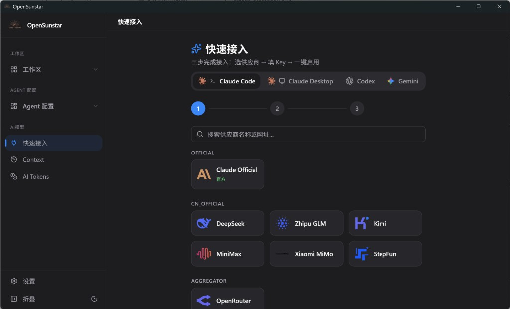
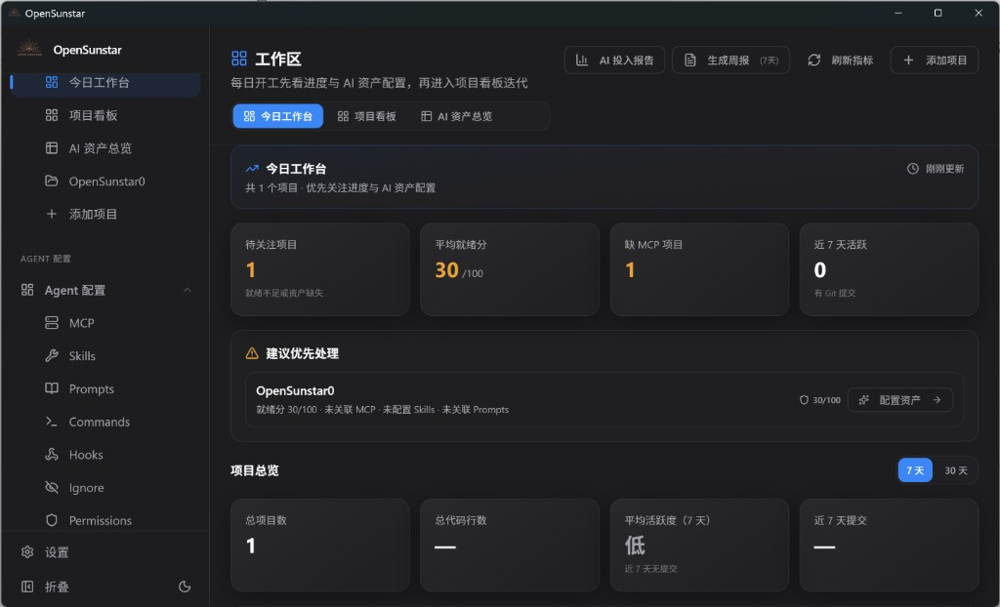

<div align="center">

# OpenSunstar

### Claude Code / Codex / Gemini CLI 等 AI 编程工具的一站式桌面管理器

[](https://github.com/alisunstar/OpenSunstar/releases)
[](LICENSE)
[](https://github.com/alisunstar/OpenSunstar/releases)
[](https://tauri.app/)

**代码仓库：** [github.com/alisunstar/OpenSunstar](https://github.com/alisunstar/OpenSunstar)

[English](README.md) | 中文 | [日本語](README_JA.md) | [Deutsch](README_DE.md) | [更新日志](CHANGELOG.md)

</div>

---

## 目录

- [一. 什么是 OpenSunstar](#一-什么是-opensunstar)
  - [OpenSunstar 目标用户精准画像](#opensunstar-目标用户精准画像)
  - [核心适用场景（8 大场景）](#核心适用场景8-大场景)
  - [解决的 6 大具体痛点](#解决的-6-大具体痛点)
  - [核心特性一览](#核心特性一览)
- [二. 安装指南](#二-安装指南)
- [三. 快速开始](#三-快速开始)
- [四. 常见问题 FAQ](#四-常见问题-faq)
- [附录](#附录)
  - [文档](#文档)
  - [开发](#开发)
  - [参与贡献](#参与贡献)
  - [致谢](#致谢)
  - [许可证](#许可证)

---

## 一. 什么是 OpenSunstar

**OpenSunstar** 是基于 Tauri 2 + React 的跨平台原生桌面应用，面向 AI 编程 CLI 时代，把**供应商接入、Agent 配置、多项目治理**收敛到一处——从「改配置文件」升级为「看清项目、补齐资产、持续交付」。

### OpenSunstar 目标用户精准画像

#### 🎯 核心用户画像（5 类典型人物）

| 类型 | 典型特征 | 核心诉求 |
| ---- | -------- | -------- |
| **多栈 AI CLI 开发者** | 同时使用 Claude Code / Codex / Gemini 等 2–3 款工具 | 一处切换供应商，少改 JSON / TOML / `.env` |
| **AI 编程新手 / 副业转型者** | 刚接触 CLI Agent，不熟悉各厂商配置格式 | **快速接入**三步完成：选供应商 → 填 Key → 一键启用 |
| **多项目独立开发者** | 维护多个 side project / 客户仓库 | 开机第一眼看清：哪些项目停滞、AI 资产是否到位 |
| **Tech Lead / 全栈负责人** | 并行多个 Git 仓库，需阶段与风险感知 | 项目看板、就绪度评分、AI 周报与投入报告 |
| **Agent 配置重度用户** | 深度使用 MCP、Skills、Prompts、Hooks | 统一安装/同步，skills.sh 排行榜与 Smithery 发现 |

#### 🚫 不是谁（非目标用户）

- **不使用 AI CLI 的传统开发团队** — 无 Claude Code / Codex / Gemini 等接入需求
- **只绑定单一官方订阅、从不切换供应商** — 仅需官方客户端即可，OpenSunstar 价值有限
- **需要 Jira / Linear 式任务看板的 PM** — OpenSunstar 工作区是 **AI 治理仪表盘**，不是 Issue 拖拽看板
- **纯云端 SaaS 配置中心诉求** — OpenSunstar 是**本地桌面 + 可选云同步**，非托管 SaaS

### 核心适用场景（8 大场景）

1. **三步快速接入** — Claude Code / Desktop / Codex / Gemini 精选向导（官方 · 国产 · OpenRouter · 自定义）
2. **多工具供应商切换** — 主界面或系统托盘一键切换，Claude Code 支持热切换
3. **统一 Agent 资产配置** — MCP / Skills / Prompts / Commands / Hooks / Ignore / Permissions / Subagents
4. **MCP & Skills 发现安装** — Smithery 注册表、skills.sh 官方排行榜（全站总榜 / 24h 趋势 TOP 50）
5. **多 Git 仓库项目治理** — 今日工作台、项目看板、AI 资产总览矩阵
6. **按项目补齐 AI 资产** — Agent 就绪度评分 + 缺 MCP / Skills / Prompts 直达配置
7. **用量与成本管控** — Token 统计、预算告警、AI 投入报告与组合周报
8. **配置备份与跨设备同步** — WebDAV / S3 兼容 / Gist，Deep Link 一键导入

### 解决的 6 大具体痛点

| # | 痛点 | OpenSunstar 如何解决 |
| - | ---- | -------------------- |
| 1 | 各 CLI 配置格式不同，手动编辑易错 | 可视化供应商管理 + 快速接入向导，自动写入 live 配置 |
| 2 | 切换 API 供应商需逐个改文件 | 一处切换，本地代理 + 格式转换，托盘快捷切换 |
| 3 | 单供应商故障导致工作流中断 | 故障转移队列、熔断器、健康监控 |
| 4 | MCP / Skills / Prompts 分散难统一 | Agent 配置统一面板，按应用双向同步 |
| 5 | 无法直观监控 API 用量与费用 | AI Tokens 仪表盘、预算告警、自定义模型定价 |
| 6 | 多项目缺少 AI 就绪度与资产视图 | 工作区就绪度评分、资产矩阵、项目级 AI 配置 |

### 核心特性一览

| 特性 | 说明 |
| ---- | ---- |
| **7 个 CLI 工具** | Claude Code · Claude Desktop · Codex · Gemini CLI · OpenCode · OpenClaw · Hermes |
| **快速接入向导** | 四应用精选：Official / CN Official / Aggregator / Custom |
| **60+ 供应商预设** | 设置中完整预设库；快速接入为精选子集 |
| **Agent 配置管理** | MCP · Skills · Prompts · Commands · Hooks · Ignore · Permissions · Subagents |
| **本地代理与高可用** | 格式转换、故障转移、熔断器、请求整流 |
| **工作区治理** | 今日工作台 · 项目看板 · AI 资产总览 · Agent 就绪度 |
| **Skills / MCP 发现** | skills.sh 排行榜 · Smithery · ClawHub · ModelScope · GitHub |
| **密钥安全** | OS Keychain 优先，SQLite 原子写入 |
| **云同步与备份** | WebDAV / S3 / Gist · 自动备份 · Deep Link 导入 |
| **跨平台桌面** | Windows · macOS · Linux · 深色/浅色主题 · 多语言 |

### 支持的 CLI 工具

| Claude Code | Claude Desktop | Codex | Gemini CLI | OpenCode | OpenClaw | Hermes |
| :---------: | :------------: | :---: | :--------: | :------: | :------: | :----: |

### 界面预览

| 快速接入 | 今日工作台 |
| :------: | :--------: |
|  |  |

> **v0.1.0** 为首次公开发布版本，可日常使用；工作区与 AI 资产闭环能力仍在持续迭代。

---

## 二. 安装指南

### 下载安装（推荐）

从 [GitHub Releases](https://github.com/alisunstar/OpenSunstar/releases/latest) 获取最新构建。

| 平台 | 安装包 |
| ---- | ------ |
| **Windows** | `.msi` 安装包或 Portable `.zip` 绿色版 |
| **macOS** | `.dmg`（已签名公证）· `brew install --cask OpenSunstar` |
| **Linux** | `.deb` · `.rpm` · `.AppImage` · AUR `OpenSunstar-bin` |

**系统要求：** Windows 10+ · macOS 12+ · Ubuntu 22.04+ / Debian 11+ / Fedora 34+

### 源码构建

见附录 [开发](#开发)。

---

## 三. 快速开始

### 首次启动

1. 首次运行可**自动导入**现有 CLI 配置为 default 供应商。
2. 若弹出引导向导，按提示完成即可。

### 三步接入 CLI

1. 侧边栏 → **快速接入**
2. 选择目标应用：**Claude Code**、**Claude Desktop**、**Codex** 或 **Gemini**
3. 选择精选供应商 → 填写 API Key（或按官方 OAuth 指引）→ **验证并应用**

官方供应商（Anthropic / OpenAI / Google）需在 **设置 → 供应商管理** 中完成浏览器登录。

> **代理提示：** Claude Code、Codex、Gemini、Claude Desktop 使用时请**保持 OpenSunstar 运行**，CLI 请求经本地代理转发。

### 切换供应商

- 在主界面或**系统托盘**切换当前供应商
- 大多数 CLI 切换后需**重启终端**（Claude Code 支持**热切换**）

### 配置工作区

1. 侧边栏 → **工作区** → **添加项目**，绑定本地 Git 仓库
2. 打开 **今日工作台** 查看待办与就绪度缺口
3. 在 **项目看板** 查看提交活跃度与 AI 组合报告
4. 进入项目的 **AI 配置** 管理仓库级 MCP / Skills / Prompts

### 探索 Agent 工具

| 目标 | 入口 |
| ---- | ---- |
| 安装 MCP | Agent 配置 → **MCP** → 发现（Smithery / 注册表） |
| 浏览热门 Skills | Agent 配置 → **Skills** → skills.sh 排行榜 |
| 管理 Prompts / Hooks | Agent 配置 → **Prompts** / **Commands** / **Hooks** |
| 查看 Token 用量 | 侧边栏 → **AI Tokens** |

---

## 四. 常见问题 FAQ

<details>
<summary><strong>支持哪些 AI 工具？</strong></summary>

七个工具：Claude Code、Claude Desktop、Codex、Gemini CLI、OpenCode、OpenClaw、Hermes。快速接入向导覆盖前四个；全部七个可在供应商与 Agent 面板中管理。
</details>

<details>
<summary><strong>切换供应商后要重启终端吗？</strong></summary>

大多数 CLI 需要重启终端。Claude Code 例外，支持热切换。
</details>

<details>
<summary><strong>为什么需要保持 OpenSunstar 运行？</strong></summary>

部分 CLI 的配置会指向 OpenSunstar 本地代理。关闭应用后代理停止，CLI 可能出现连接失败，需重新启动 OpenSunstar。
</details>

<details>
<summary><strong>数据存储在哪里？</strong></summary>

| 路径 | 用途 |
| ---- | ---- |
| `~/.OpenSunstar/OpenSunstar.db` | SQLite 数据库（供应商、MCP、项目、资产） |
| `~/.OpenSunstar/settings.json` | 应用设置 |
| `~/.OpenSunstar/backups/` | 自动备份（保留最近 10 份） |
| `~/.OpenSunstar/skills/` | 已安装 Skills 缓存 |
| `~/.OpenSunstar/cache/` | 远程数据缓存（如 skills.sh 排行榜，约 6 小时 TTL） |
</details>

<details>
<summary><strong>如何切回官方登录？</strong></summary>

添加或选择 **Official（官方）** 预设供应商并切换，然后在终端执行对应 CLI 的 Log out / Log in 流程。
</details>

<details>
<summary><strong>「工作区」是任务看板吗？</strong></summary>

不是。工作区是**多仓库 AI 治理仪表盘**——Git 健康度、Agent 就绪度、项目级资产与 AI 洞察——而非拖拽式 Issue 看板。
</details>

<details>
<summary><strong>skills.sh 排行榜多久更新一次？</strong></summary>

从 skills.sh 拉取后本地缓存约 6 小时。界面显示上次同步时间；可手动刷新强制更新。
</details>

---

## 附录

### 文档

| 资源 | 链接 |
| ---- | ---- |
| 用户手册（中文） | [docs/user-manual/zh/README.md](docs/user-manual/zh/README.md) |
| 用户手册（English） | [docs/user-manual/en/README.md](docs/user-manual/en/README.md) |
| 用户手册（繁體） | [docs/user-manual/zh-TW/README.md](docs/user-manual/zh-TW/README.md) |
| 用户手册（日本語） | [docs/user-manual/ja/README.md](docs/user-manual/ja/README.md) |
| 用户手册（Deutsch） | [docs/user-manual/de/README.md](docs/user-manual/de/README.md) |
| 工作区模块说明 | [docs/kanban.md](docs/kanban.md) |
| v0.1.0 发布说明 | [docs/release-notes/v0.1.0-zh.md](docs/release-notes/v0.1.0-zh.md) |

### 开发

**技术栈：** React 18 · TypeScript · Vite · Tauri 2 · Rust · SQLite · TanStack Query

**环境要求：** Node.js 20+ · pnpm · Rust 1.85+ · 各平台 Tauri 构建依赖

```bash
pnpm install
pnpm tauri dev        # 桌面开发模式
pnpm dev:renderer     # 仅前端
pnpm typecheck        # 类型检查
pnpm test:unit        # 单元测试
pnpm tauri build      # 生产构建
```

### 参与贡献

欢迎提交 Issue 与 PR。提交前请确保：

```bash
pnpm typecheck && pnpm format:check && pnpm test:unit
```

详见 [CONTRIBUTING.md](CONTRIBUTING.md)。合作伙伴与赞助信息见 [SUPPORT.md](SUPPORT.md)。

### 致谢

OpenSunstar **并非** [cc-switch](https://github.com/farion1231/cc-switch) 的官方分支或维护项目，与 cc-switch 维护团队**无隶属或授权关系**。

本项目部分基础能力（供应商管理、Agent 配置、本地代理等）源自 cc-switch 代码库，遵循其 [MIT License](https://github.com/farion1231/cc-switch/blob/main/LICENSE)（`Copyright (c) 2025 Jason Young`）。README / 文档中出现的 **Jason Young** 署名惯例亦来自 cc-switch 上游，**不代表** OpenSunstar 由 cc-switch 原维护者运营。

感谢 cc-switch 社区的开源贡献。OpenSunstar 在此基础上独立演进，侧重**工作区治理、项目级 AI 资产与 Agent 就绪度**等差异化能力。

### 许可证

[MIT](LICENSE)

核心开源；团队/企业能力以单独商业协议提供（规划中）。
